# Taller Openshift


## Resumen
Este tutorial está pensado para que te puedas familiarizar con las capacidades más interesantes de Redhat Openshift, mediante la realización de un par de ejemplos, donde desplegarás y gestionarás aplicaciones dentro de la plataforma de orquestación de contenedores.

## Tecnologías

- [Kubernetes](https://cloud.ibm.com/docs/containers?topic=containers-getting-started)
- [Openshift](https://cloud.ibm.com/docs/openshift?topic=openshift-getting-started)
- [Watson Assistant](https://cloud.ibm.com/docs/assistant?topic=assistant-getting-started)
- [Node.js](https://nodejs.org/en/docs/guides/getting-started-guide/)


Tiempo estimado: 30 a 45 minutos.

## Prerequisitos
- Contar con una cuenta de [IBM Cloud](https://cloud.ibm.com/). 
- Disponer de un cluster de Openshift desplegado.
- Tener desplegado un skill en [Watson Assistant](https://cloud.ibm.com/catalog/services/watson-assistant) con las intenciones, los diálogos y las entidades configuradas. 

## Índice
- Taller 1 - [Crea, escala y actualiza tu primera app en Openshift](https://github.com/luisreyesoliva/taller-openshift#taller-1---crea-escala-y-actualiza-tu-primera-app-en-openshift)
- Taller 2 - [Despliega una aplicación en Openshift e intégrala con un asistente virtual](https://github.com/luisreyesoliva/taller-openshift#taller-2---despliega-una-aplicaci%C3%B3n-en-openshift-e-int%C3%A9grala-con-un-asistente-virtual)

## Taller 1 - Crea, escala y actualiza tu primera app en Openshift

En este primer taller, veremos cómo gestionar un ciclo de vida básico de una aplicación en Openshift.
Aprenderás a crear y desplegar una aplicación a partir de una imagen Docker, escalarla, actualizar a una versión más moderna y finalmente, hacer rollback a una versión anterior.

Este ejemplo está basado en el tutorial que puedes encontrar aquí [Create, scale, upgrade, and rollback an application on Red Hat OpenShift](https://developer.ibm.com/tutorials/create-scale-upgrade-and-rollback-an-application-in-red-hat-openshift/)

### 1.1 Accede al Cluster de Openshift
1. Accede a tu cuenta IBM Cloud.

2. Desde la barra lateral dirigete a **Openshift > Clusters**
 

3. Selecciona el Cluster asignado y te redirigirá a una consola como la siguiente: 


4. Selecciona en la esquina superior derecha **Openshift Web Console** (*)

5. En la esquina superior derecha pincha en **IAM#user_email** y posteriormente en **Copy Login Command**


Copia el comando que se muestra debajo de **Log in with this token**

6. En la consola de IBM Cloud, accede a IBM Cloud Shell desde la esquina superior derecha: 


7. Ejecuta el comando copiado en el paso 5. 

(*) **En caso de que no se abriera la consola de Openshift, podría ser un problema con el acceso al puerto, verifica que el puerto esté abierto y permita la salida a internet**
### 1.2 Crea una aplicación a partir de una imagen Docker

1. En IBM Cloud Shell, crea un nuevo proyecto: 

```
oc new-project guestbook-project
```


2. Crea un nuevo despliegue haciendo uso de la imagen [ibmcom/guestbook:v1](https://hub.docker.com/r/ibmcom/guestbook/tags): 

```
oc create deployment myguestbook --image=ibmcom/guestbook:v1
```


3. El despliegue crea el pod, se puede comprobar que el mismo ya se encuentra en estado "Running" a través del siguiente comando: 

```
oc get pods
```


4. Para exponer el despliegue, se crear un Servicio, que expondrá el puerto 3000 del contenedor en un puerto del nodo (NodePort): 

```
oc expose deployment myguestbook --type="NodePort" --port=3000
```


5. Para ver el servicio que acabamos de exponer, utiliza el siguiente comando:
 
```
oc get service
```


Se podría acceder al servicio usando <NodeIP:NodePort>, pero en el caso de OpenShift en IBM Cloud, el NodeIP no es accesible de manera pública. 

 6. Para exponer el servicio de manera pública, es necesario crear una ruta pública. Para ello:
 - En la consola de Openshift Container Platform, desde la perspectiva de Administrador, accedemos al proyecto que nos acabamos de crear desde linea de comando **Home > Projects** 
 - Una vez en el proyecto, entramos en **Networking > Routes**, luego pulsamos **Create Route**

 7. Rellena los campos de la siguiente manera, considerando principalmente: 
 - **Name:** myguestbook
 - **Service:** myguestbook
 - **Target Port:** 3000→3000(TCP)
  


Una vez creada la ruta, nos redirigirá a nuestra Route Overview, desde ese apartado, es posible acceder a la ruta externa haciendo uso de la URL debajo de **Location**
  


La URL debería rediriginirnos a una página similar a la siguiente
  


### 1.3 Escala la aplicación replicando los pods
En esta sección, vamos a escalar la aplicación creando réplicas de los pod que creamos previamente. El tener múltiples replicas de un mismo pod nos permite asegurar que el despliegue cuenta con los recursos disponibles para soportar un incremento de carga en la aplicación. 


 1. En IBM Cloud Shell, incrementamos la capacidad de una única instancia de Guestbook, a 5 instancias: 
 
```
oc scale --replicas=5 deployment/myguestbook
```
 
 


 2. Comprueba el estado del despliegue

```
oc rollout status deployment myguestbook
```

 

 3. Verifica que ahora se tienen 5 pods en estado "Running" después de escalarlo. 
 
```
oc get pods -n guestbook-project
```


 
### 1.4 Actualiza la aplicación
Con Openshift, es posible realizar una actualización continua de la aplicación a una nueva imagen. Con esta modalidad, es posible actualizar la imagen y deshacer los cambios si se encuentra un problema durante el despliegue. 
  
A continuación, actualizatemos la imagen con la tag v1, a una nueva versión v2. 
  
 1. En IBM Cloud Shell, actualizamos el despliegue utilizando la imagen v2 (dicha actualización también es conocida como Rollout):
 
```
oc set image deployment/myguestbook guestbook=ibmcom/guestbook:v2
```

 

 2. Comprueba el estado del rollout:
 
```
oc rollout status deployment/myguestbook
```


 3. Obtén una lista de los nuevos pods desplegados como parte del cambio de imagen:

```
oc get pods -n guestbook-project
```


 4. Copia el nombre de uno de los pods y confirma que está utilizando la imagen v2 a través del siguiente comando:

```
oc describe pod <pod-name>
```
 

 5. Actualiza la URL y verás los cambios en la aplicación. El Pod está utilizando la imagen v2 de la aplicación Guestbook. 


En caso que continúe apareciendo la versión antigua, es necesario forzar la actualización de la página para eliminar la caché.
 - En la mayoría de los navegadores en Windows se realiza con `ctrl+F5`
 - En Mac, el hard refresh es con `mays+cmd+r`

 <p align="center">
  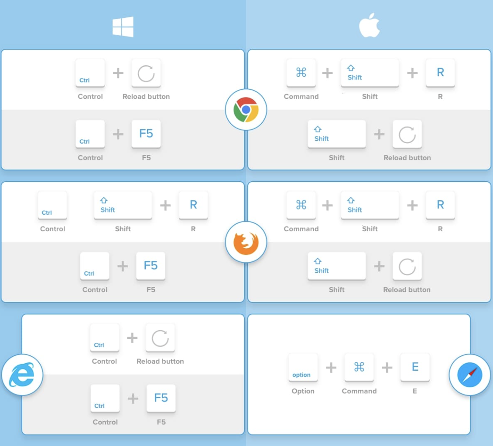</img>
</p>

### 1.5 Haz rollback de la aplicación
Cuando se realiza una actualización en el deployment, es posible ver referencias a las antiguas replicas y a las nuevas. En el proyecto, las antiguas replicas son los 5 pods originales desplegados en la sección 2. Las replicas nuevas son las que se han creado con la nueva imagen. 
Kubernetes siempre permite navegar entre las replicas y recuperar estados previos.
  
Todos los pods pertenecen al despliegue, y es quién se encarga de gestionarlos a través de un recurso llamado ReplicaSet. 

1. Para ver las ReplicaSet que tenemos, utiliza el siguiente comando: 

```
oc  get replicasets -l app=myguestbook
```

 

2. Haz un rollback con el siguiente comando: 

```
oc rollout undo deployment/myguestbook
```


 3. Obtén el estado del despliegue para ver los nuevo pods creados como parte de deshacer el rollout.

```
oc rollout status deployment/myguestbook
```


 4. Obtén una lista de los nuevos pods creados como consecuencia de deshacer el rollout: 

```
oc get pods
```


 5. Copia el nombre de uno de los pods y comprueba la versión de la imagen que utiliza: 

 ```
 oc describe pod <pod-name>
```


 6. Después de deshacer el rollout, comprueba las ReplicaSets para notar que el replicaSet antiguo está ahora activo y gestiona 5 pods:


 ```
 oc get replicasets -l app=myguestbook
```


 7. Actualiza la URL para notar que el Pod está utilizando de nuevo la imagen v1 de la aplicación Guestbook. 
  
### 1.6 Resumen
Ahora sabemos cómo desplegar, escalar, actualizar y deshacer actualizaciones (rollback) aplicaciones en Openshift. Con este conocimiento es posible desplegar aplicaciones a partir de imágenes Docker, escalarlas para una determinada carga de trabajo, actualizarlas a nuevas versiones y volver a antiguas versiones en caso de bugs o problemas sobre las nuevas versiones. 

## Taller 2 - Despliega una aplicación en Openshift e intégrala con un asistente virtual

En este segundo taller, vamos a desplegar una aplicación usando la interface gráfica de Openshift en IBM Cloud. Desde ahí crearemos nuestra aplicación de chat en Openshift, que integraremos con un asistente virtual desplegado también en IBM Cloud.
Para ello usaremos un recurso de Kubernetes llamado ConfigMap que nos permitirá configurar las variables de entorno que usará el pod desplegado. 

### 2.1 Accede a la consola de Openshift

Desde la consola web de IBM Cloud, acceder a tu cluster.
Una vez dentro accede a la consola de Openshift

<p align="center">
  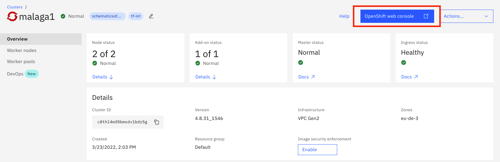</img>
</p>

### 2.2 Crea un nuevo proyecto

Dentro de la perspectiva de Administrador, selecciona "Proyectos" y haz click en Crear 

<p align="center">
  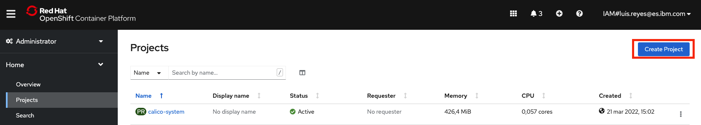</img>
</p>

Damos un nombre a nuestro proyecto y le damos a crear.

<p align="center">
  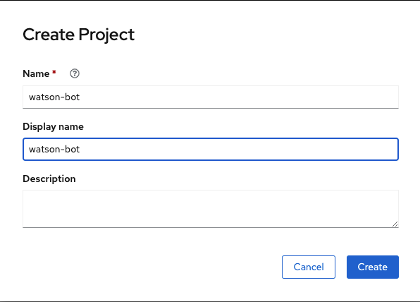</img>
</p>

Con esto, ya tenemos nuestro namespace (proyecto en terminología Openshift) listo para albergar nuestras aplicaciones.

### 2.3 Crea la aplicación a partir de una imagen Docker

Ahora crearemos la aplicación a partir de una imagen Docker que tenemos preparada previamente en nuestro Dockerhub.

Esta aplicación está preparada para conectarse a un servicio de Watson Assistant e interactuar con él mediante una interface web, en la que también se podrá visualizar la información en formato json que devuelve en asistente en cada interacción.

Lo primero que haremos será crear una nueva aplicación a partir de una imagen. Para ello, desde la perspectiva de Desarrollador, selecciona crear nueva aplicación y elige Imagen de Contenedor de entre todas las diferentes opciones que ofrece Openshift.

<p align="center">
  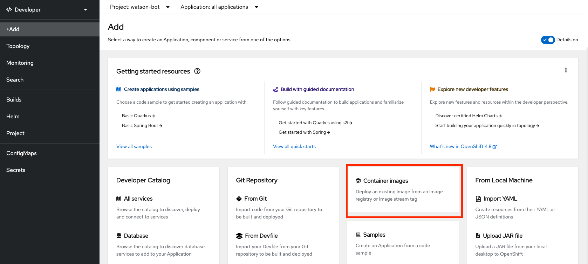</img>
</p>

Esto nos lleva a un formulario de creación de aplicaciones donde tendremos que indicar la imagen de contenedor correspondiente.

```
luisreyes/watson-bot:1.0
```

Por sencillez, hemos dejado la imagen disponible en el Dockerhub, pero en entornos empresariales usaremos siempre el registro privado de contenedores que proporciona Openshift Container Platform para asegurar que nuestras imágenes cumplen con todos los requistos de seguridad.

No hace falta indicar nada más. Openshift creará por defecto todos los recursos necesarios (pods, replicaset, deployment, servcicios) para que la aplicación se ponga en marcha.


<p align="center">
  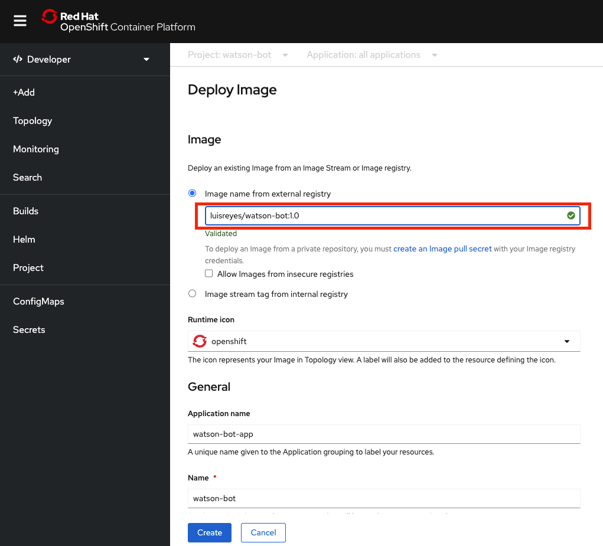</img>
</p>

### 2.4 Revisar estado del pod

Cuando Openshift intente arrancar la apliación, obtendrá un error de acceso a Watson Assistant debido a que las credenciales no están configuradas todavía. Puedes ver el estado del pod y los logs accediendo a la vista de Topología y desde ahí a la aplicación.

<p align="center">
  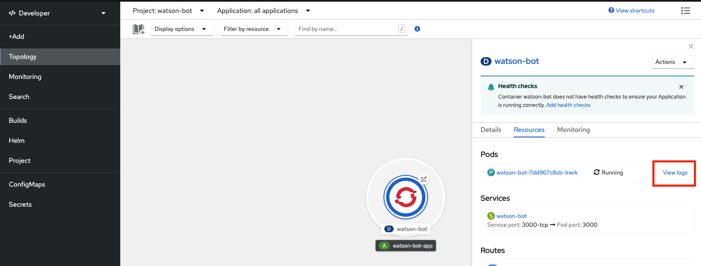</img>
</p>

Si entramos en los logs veremos que, efectívamente, la aplicación espera un parámetro que no encuentra en las variables de entorno. 

<p align="center">
  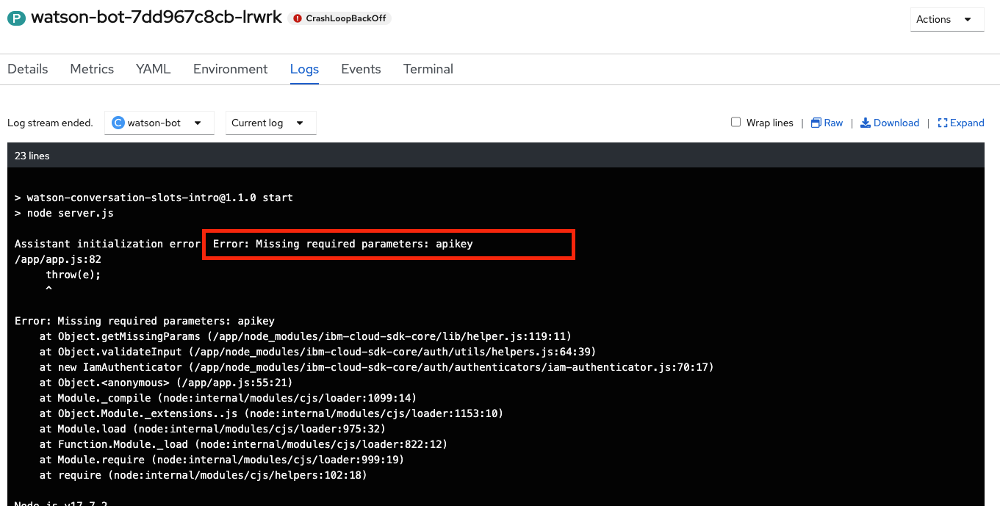</img>
</p>

Vamos a resolver este problema, para ello usaremos un ConfigMap.

### 2.5 Crear un ConfigMap e inyectarlo en el pod

Ahora crearemos un recurso específico de Kubernetes para la gestión de variables de entorno. El ConfigMap. 
Volvemos a la perspectiva de Administrador y desde ahí vamos a la opción de menú **Workloads > ConfigMap**. Creamos un nuevo ConfigMap y sobreescribimos la definición por defecto con el yaml que tenéis a continuación:

```
apiVersion: v1
kind: ConfigMap
metadata:
  name: watson-bot-cm
  namespace: watson-bot
data:
  CONVERSATION_IAM_APIKEY: <your_apikey>
  CONVERSATION_URL: <your_url>
  WORKSPACE_ID: <your_workspace>

```
Sustituye los valores para cada clave con las credenciales del servicio de Watson Assistant.
Para obtener las credenciales de acceso al servicio desplegado, accede a dicho servicio y copia los valores correspondientes a API_KEY y SERVICE_URL que puedes encontrar en la pantalla principal del servicio desplegado.

<p align="center">
  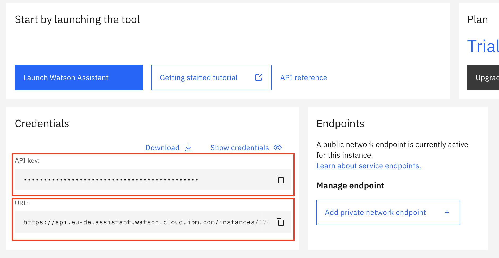</img>
</p>

También tendrás que acceder al skill concreto y a los detalles del API para obtener el valor al parámetro WORKSPACE_ID


<p align="center">
  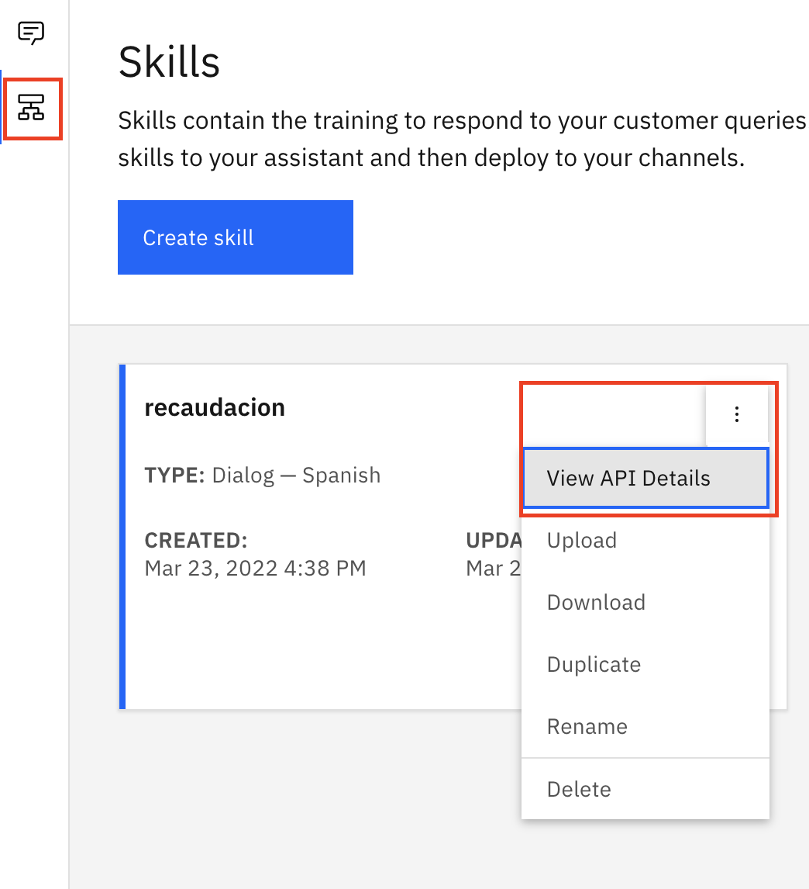</img>
</p>


Copia el campo SkillID

<p align="center">
  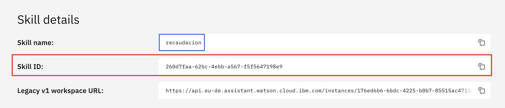</img>
</p>


Una vez configurado el ConfigMap, dale al boton crear. 
Ya tenemos nuestro ConfigMap preparado con los parámetros y los valores que espera la aplicación.

Ahora tenemos que "inyectar" ese ConfigMap en los pods desplegados. Para ello, volvemos de nuevo a la perspectiva de Desarrollador, a la vista de Topología, y desde ahí Editamos el Deployment. 

<p align="center">
  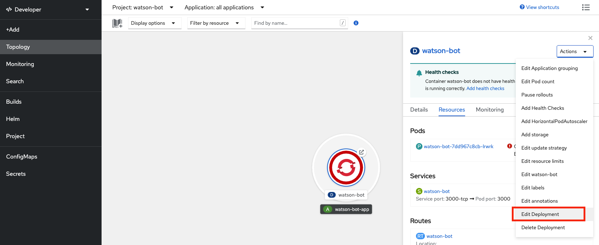</img>
</p>

Dentro del formulario de edición, iremos a la sección de Variables de Entorno y crearemos las variables necesarias que está esperando leer la aplicación.
- CONVERSATION_IAM_APIKEY
- CONVERSATION_URL
- WORKSPACE_ID

Para cada una de estas variables, seleccionaremos el ConfigMap creado anteriormente y la clave que corresponde a dichas variables. 

<p align="center">
  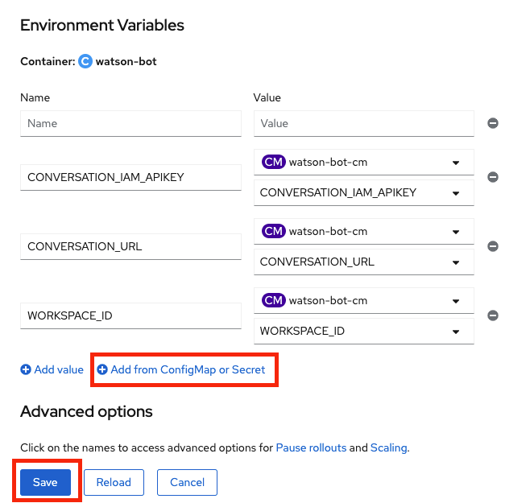</img>
</p>

Esto es todo. Salva el Deployment. 

### 2.6 Comprobar que la aplicación funciona correctamente

Openshift volverá a regenerar el pod en cuanto salvemos la nueva versión del Deployment.
Si todo ha ido bien, el Pod ahora sí se ejecutará correctamente (comprueba de nuevo el Log). 
Ahora, simplemente, accede a la Ruta que Openshift ha creado para acceder desde un navegador, y prepárate a disfrutar con tu nuevo Bot.

<p align="center">
  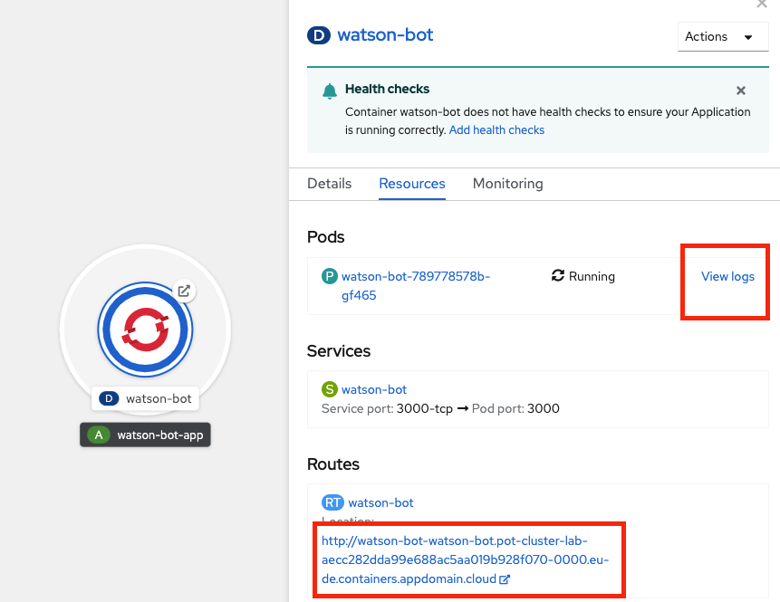</img>
</p>

Ya podemos interactuar con Watson Assistant!

<p align="center">
  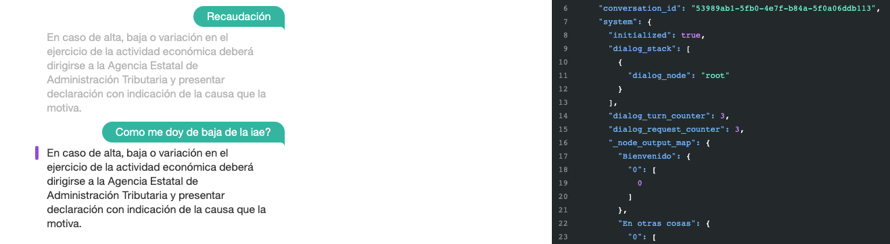</img>
</p>

Este taller y el código que usamos está basado en el tutorial que puedes encontrar aquí [Watson Assitant Slots Intro](https://github.com/IBM/watson-assistant-slots-intro)

## Licencia

Este tutorial se encuentra licenciado bajo Apache License, Version 2. Objetos de código de terceros invocados en dentro de este Code Pattern se encuentran licenciados bajo sus respectivos proveedores en conformidad con los términos de sus correspondientes licencias. Todas las contribuciones se encuentran sujetas al [Developer Certificate of Origin, Version 1.1](https://developercertificate.org/) y la [Apache License, Version 2](https://www.apache.org/licenses/LICENSE-2.0.txt).

[Preguntas frecuentes sobre Apache License](https://www.apache.org/foundation/license-faq.html#WhatDoesItMEAN)
